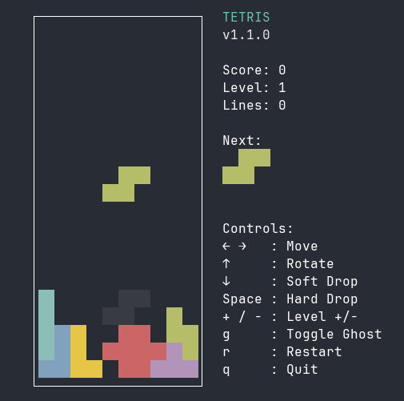

# TETRIS Game in Golang with pterm

A TUI TETRIS game implemented in Golang with [pterm](https://github.com/pterm/pterm)
library for terminal rendering.

## Features

- Classic TETRIS gameplay with all 7 tetromino shapes
- Colorful terminal-based graphics
- Score tracking and level progression
- Next piece preview
- Centered display that adapts to terminal size
- Proper terminal cleanup when exiting



## Installation

1. Make sure you have Go installed (version 1.16 or later)
2. Clone or download this repository
3. Navigate to the project directory

## Building

```bash
go build -o tetris cmd/tetris/main.go
```

## Running

```bash
go run cmd/tetris/main.go
```

Or if you built the binary:

```bash
./tetris
```

## Controls

- **← →** : Move left/right
- **↑** : Rotate piece
- **↓** : Soft drop (move down faster)
- **Space** : Hard drop (instantly drop piece)
- **g** : Toggle ghost piece (show/hide drop projection)
- **q** : Quit game

## License

This project is licensed under the MIT License - see the [LICENSE](LICENSE) file for details.
